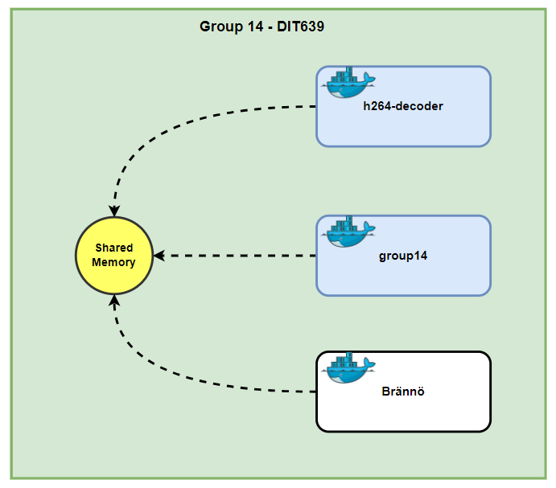
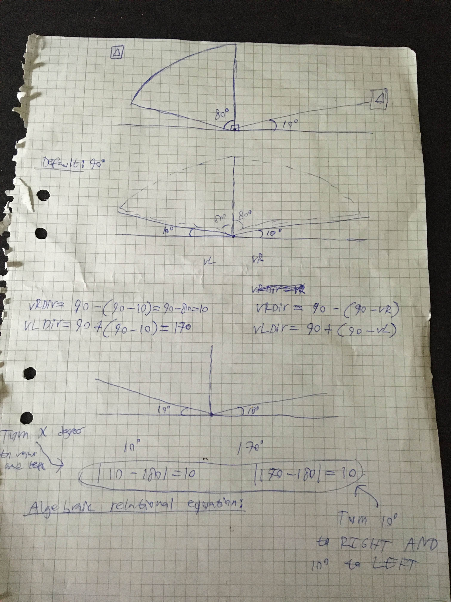

# Project Brännö

This project was developed in cohesion with the course [Cyber Physical Systems of Systems](https://gitlab.com/jex-projects/mrjex/-/tree/main/projects/1.%20courses/year-2/7.%20Cyber%20Physical%20Systems%20and%20Sytems%20of%20Systems?ref_type=heads) as an additional supplementary system, extending beyond the requirements and scope of that particular course. It's worth noting that me and my group of 4 students were enthusiastic about the contents of this course and had a vision for something more ambitious than what the University course offered. That's not to say that the course was easy in any way, we simply understood the profoundness and potential of the newly introduced technologies, such as Docker and OpenCV.

In this project, we used the knowledge we gained from course X [Link to the architecture course directory here] to realize an appropriate architecture with respect to the given constraints and tasks of the Cyber Physical Systems of Systems course. In essence, this architectural solution not only completes the given task, but allows for a variety of different tasks to be fulfilled at large scales.

## Architecture

To develop an architecture to any project, we always need to account for the provided tasks and how it can be generalized and grouped into smaller categories. These categories can then be divided based on characteristics which constitute relations between these categories. Lastly, these relations need to be defined as interactions and events between the entities of the system.

In this case, our group had the task of calculated the 'groundSteering' angle at a given frame of a provided .rec or .mp4 file. We proceeded by dividing this problem into smaller problem-spaces:

1. Detect the cones' position at each frame of a given video

2. Use the detected positions of the two closest cones to calculate 'groundSteering' angle

3. Plot the calculated 'groundSteering' angle on a chart along with the expected angle

Next, we rephrased each of the sequential steps above to a primitive word that accurately captures the semantics:

1. **Detection** - Detect cone position

2. **Algorithmic** - Backend angle calculations

3. **Visualization** - Plot the result of a graph

Now, we denoted each of the above steps as services, as we understood that it was best to separate the functionality with encapsulation. Furthermore, since each service is to be executed in sequential order and pass its data to the next service, we recognized that we were dealing with a pipe-and-filter architecture as well. Hence, 'services' and 'filter' are used synonymously throughout the documentation of this project. It's worth noting that in later stages of this project we ended up integrating a MongoDB database, establishing the architecture as a partially service-ortiented one. In other words, we deem this to be a mixed architectural solution that incorporates pipe-and-filter and service-oriented. In each filter, we saw the opportunity to implement multiple different solutions, and then asked ourselves the question if it was possible to define what implementations were to be used in an execution of the system. That's when we came up with the term "Module" to describe the inherent selected implementation of a service. Note that each contained module of a service must be related to the attached service. Below, each service and their respective modules are listed:

### Detection Services

Everything in this service is concerned with detecting the positions of the cone on a given `.mp4` or `.rec` file and outputting it in CSVs to the next filter (Algorithmic Services).

#### HSV Module

Our group did not have time to integrate this feature into this additional spare-time project. Instead, we directed our efforts and time to implementing the C++ version in the Cyber Physical Systems of Systems course [Link to HSV c++ script in the course directory here].

#### Machine Learning Module

In order to integrate this feature into this project, we used two tools:

1. **Roboflow**: We annotated certain frames of the videos and marked the parts that we wanted the machine-learning model to recognize (i.e the cones). We then the marked images to a dataset and exported it to the PyTorch model of yolov8.

2. **yolov8**: We first pass the artifact (video or image) to our customized ML-model. Once the model is in action, it produces output in accordance with the distribution of the dataset we defined in Roboflow (70% predict, 20% train, 10% test). In the context of this project we only provided the videos relevant to the given task, and the model's output is generated in "runs/detect/predictX" directories as the original video with additional boxes implying the detected objects of each frame.

### Algorithmic Services

This service recieves the processed data from `Detection Services`, parses it and performs operations on it to calculate the `groundSteering` angle at each frame of the main video. These performed operations are pre-selected and tied to the responsibility of one of the modules below:

#### Trigonometry Module

#### Linear-Regression Module

Text
- We did not have time to implement the Python version of this
- However, in the course 'Cyber Physical Systems of Systems' [Link to course here] we coded a c++ script with this implementation

Our group did not have time to integrate this feature into this additional spare-time project. Instead, we directed our efforts and time to implementing the C++ version in the Cyber Physical Systems of Systems course [Link to Linear-Regression c++ script in the course directory here]

### Visualization Services

Connected database:
- Automatically stores data instance of the execution
- Interactive mode
- "/Graphs" directory is the output

As we developed the project, we recognized the opportunity to incorporate a database into the project, to faciliate the debugging process for the developers, which incentivized us to integrate MongoDB. As such, we constructed a service-oriented architecture, with multiple services containing multiple modules, and one single centralized database

## Text Detection

Initial Document:

Designed and final documents:

Settings:

Settings:

